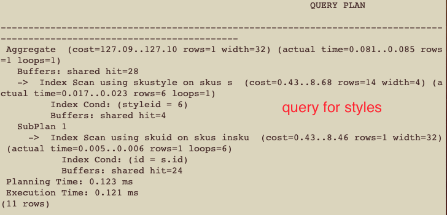
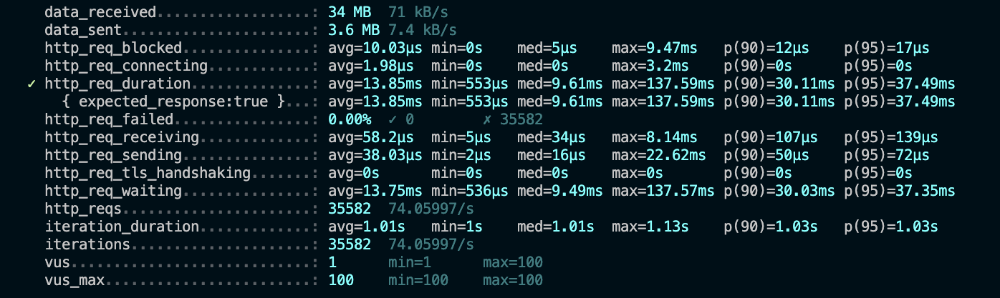
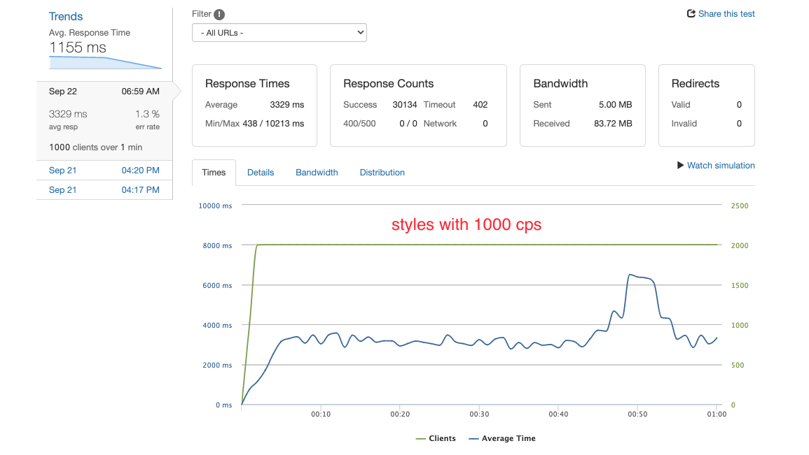
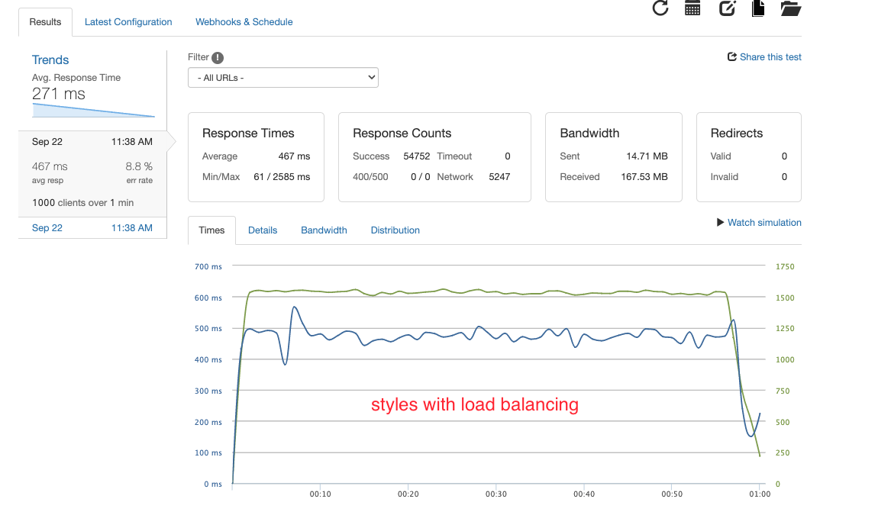
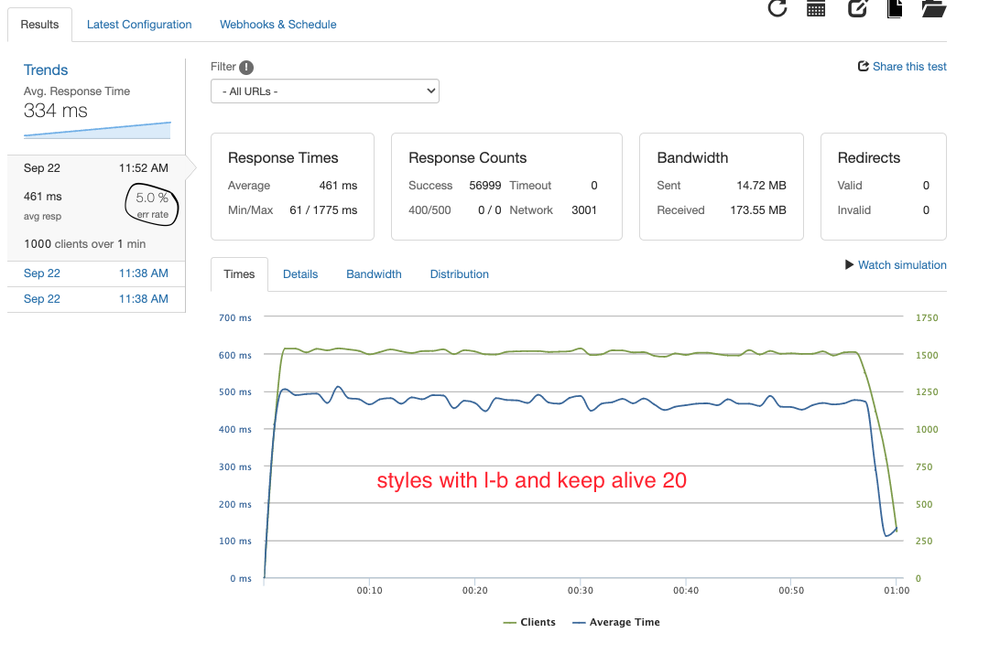
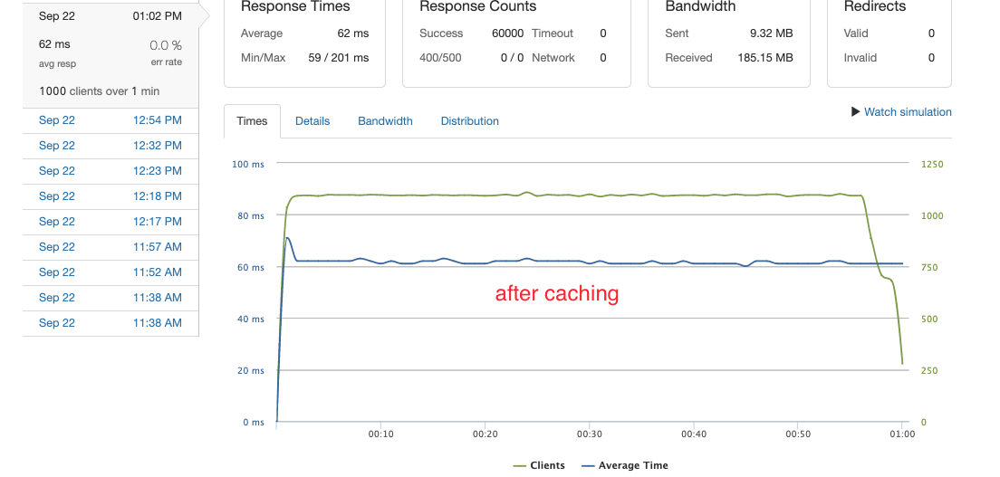

 # Atelier Product Profile Microservice
---
 Atelier product profile is a microservice that was scaled on AWS EC2 instance using 2 host servers, caching and load balancing.

 ## Tech Stack
 ---
Development:  \
Database: \
Cloud Side:  

# Details
---
For testing, the most complex select query in this microservice, styles, is chosen. Tests are benchmarked at 1000 clients per second.

## DataBase Selection:
Two databases considered were Postgresql and Mongodb. I chose Postgresql because the data I have is structured and highly relational. The biggest reason why I went with postgresql was because this microservice is read-only and with Postgres indexing, I could optimize my queries to be around 0.1 ms.

## Local Testing
K6 was used as the testing tool. The goal was to have average response time to be under 50ms.

## Cloud Testing
- ### One Host
Microservice was deployed to an Amazon EC2 instance that was located in the US West coast. Before caching, and with only one host 1000 rps had a high latency at around ~3326ms and ~1.3% of the requests were timing out.

- ### After Load Balancing With Two Hosts
Adding a second server and balancing the load using the server with least connection method drastically changed the latency, bringing it down to ~460ms. Though the error rate was still high.

Changed the load balancer's configuration to keep 20 connections alive at a time, even though it brought down the error rate, it was still above the desired min, 1%.

- ### After Adding Caching

Finally added caching using Nginx. As a result, queries response latency went down to ~62ms and error rate to 0%.

# Feature Improvements
---
Possible next steps to increase the throughput would be to add more servers. Another step would be to upgrade to more powerful machines.

# Dependencies
---
Needs npm install.
Check out package.jsonfor further details.
